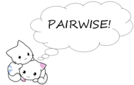

<!-- README.md is generated from README.Rmd. Please edit that file -->

# pairwise 

[](https://cran.r-project.org/package=pairwise)
[](https://github.com/JonasMoss/pairwise/actions/workflows/R-CMD-check.yaml)
[](https://www.repostatus.org/#active)
[](https://app.codecov.io/gh/JonasMoss/pairwise?branch=main)

An `R` package for estimating values using a mix of binary and cardinal
comparisons.

## Installation

The package is not available on `CRAN` yet, so use the following command
from inside `R`:

``` r
# install.packages("remotes")
remotes::install_github("JonasMoss/pairwise")
```

## Usage
